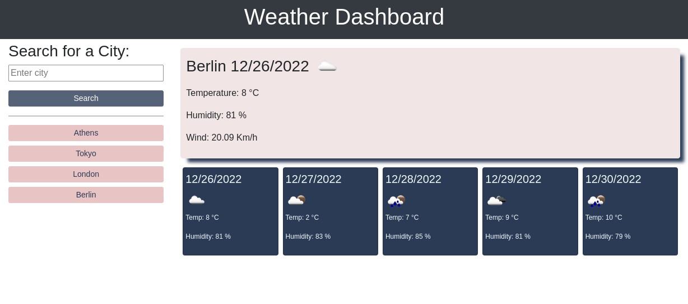
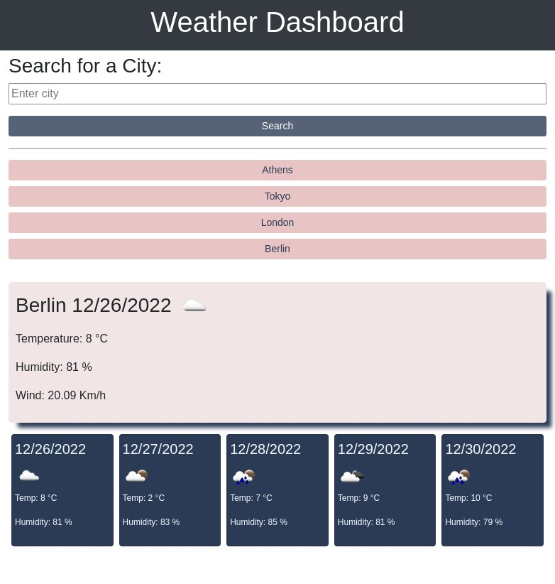

# Weather Forecast Dashboard

## Description

This is a Javascript challenge where a weather forecast app dashboard is created. The user is able to search any city they like and the page returns weather information for that city, for the current day and a forecast for the next 5 days.

To create this dashboard, an external weather forecast API was used, AJAX calls were made using API keys and dynamic URLs based on user's input. The response was filtered, sorted and displayed in a user friendly way, with the right units and user's history was stored on local storage in their browser, so they can go through it later if needed. The search history was also dynamically displayed with buttons, which can be used to get weather forecast once more without enter the city again. 

### Note:

The 5-day forecast API used, returned 5 days weather data, ***including the current day***. So although there should be a current day weather display and 5 more days forecast, in this project we only display current day and forecast of current day (later time) and 4 more days. 
## Installation (optional)

If someone wants to, they can download the code from the following repository: 
[Weather Forecast Dashboard Repository](https://github.com/QuantumK9/weather-dashboard)

## Usage

The final project can me seen in the following link:

[Quantum K - Weather Forecast Dashboard](https://quantumk9.github.io/weather-dashboard/)

## Screenshots
Desktop:

Mobile/tablet:

## Credits

This challenge was completed by Quantum K (GitHub)

## License 

MIT License